Data Science For Business Decisions
========================================================
author: Sreekanth V K, PhD
date: January 18, 2021
autosize: true

Outline
========================================================

- Introduction to Data Science Process
  + Defining research goals and creating a project charter
  + Retrieving Data
  + Cleansing, integrating, and transforming data
  + Exploratory Data Analysis
  + Modeling building
  + Presenting findings and building applications on top of them

- Machine Learning

Introduction to Data Science Process
========================================================

- Setting the Research Goal
- Retrieving Data
- Data preparation
- Data Exploration
- Data Modeling
- Presentation and Automation 

*****
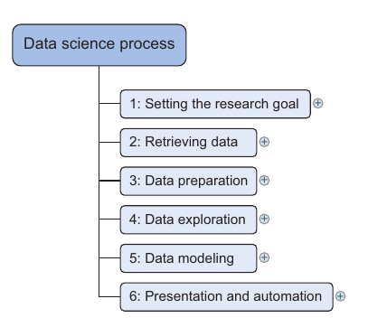
<!--  -->

Defining research goals and creating a project charter
========================================================
- A project starts by understanding **the what**, **the why**, and **the how** of your project

- Spend time understanding the goals and context of your research --
  + Many data scientists fail here: despite their mathematical wit and scientific bril-
liance, they never seem to grasp the business goals and context.

- Create a project charter
  + A clear research goal
  + The project mission and context
  + How you’re going to perform your analysis
  + What resources you expect to use
  + Proof that it’s an achievable project, or proof of concepts
  + Deliverables and a measure of success
  + A timeline

*****

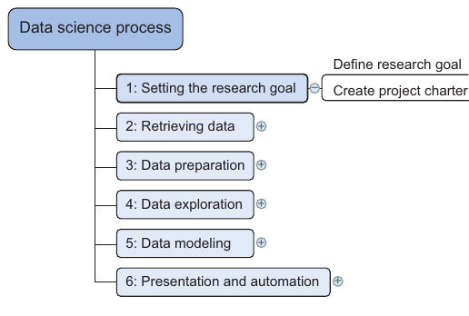

Retrieving Data
========================================================
-  Start with data stored within the company
  + Finding data even within your own company can sometimes be a challenge. 
  + __*Chinese walls*__
  + Getting access to the data may take time and involve company politics.
-  Don’t be afraid to shop around
  + Social networks and Social media
  + Open data-sets
-  Do data quality checks now to prevent problems later


*****

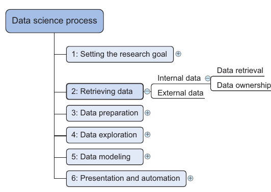

Cleansing, integrating, and transforming data
========================================================
- Extraction, Transformation, and Loading (ETL)
- Data provision
- Cleansing data
  + Interpretation error
  + Inconsistency
- Correct errors as early as possible
- Combining data from different data sources
- Transforming data
*****

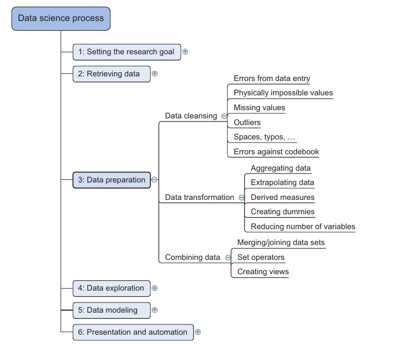

Cleansing, integrating, and transforming data
========================================================
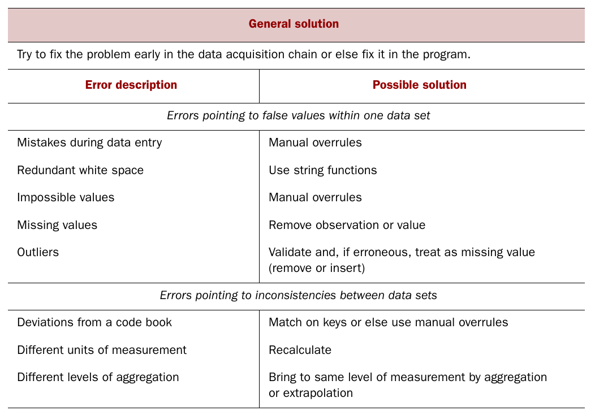

Data problems: Data Entry Errors
========================================================
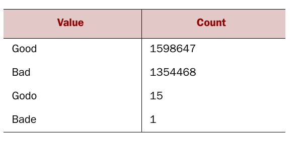
*****
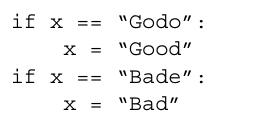

Data problems
========================================================
- Redundant whitespace
  + Case mismatching
- Impossible values and sanity checks
  + Values age, name, and others
  + check = 0 <= age <= 120
- Outliers

*****
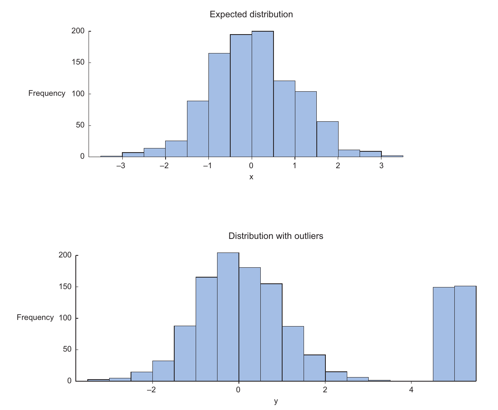

Data problems: Missing values
========================================================
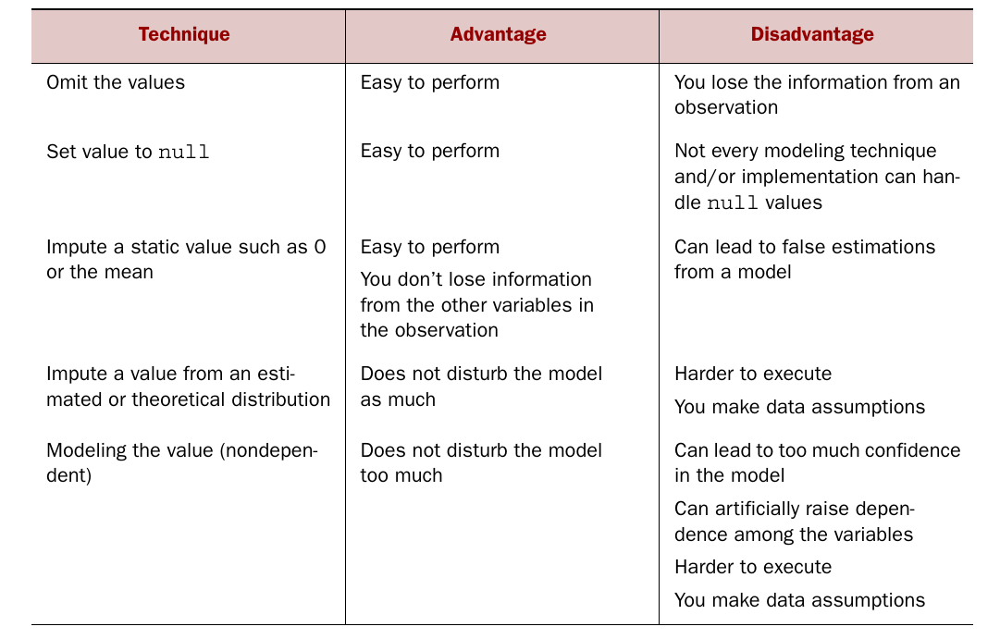

Data problems: Inconsistencies
========================================================
- Deviations from a code book
- Different units of measurement
- Different levels of aggregation


Combining and Transforming Data
========================================================
- Combining data from different data sources 
  + Joining Tables
  + Appending Tables
  + Using views to simulate the joining and appending tables
  + Enriching aggregated measures 
- Transforming data
  + Reducing the number of variables
  + Turning variables into Dummies

Exploratory Data Analysis
========================================================
- Visualizations
  - Simple to complex visual representations
  - Scattered plots, boxplots, histograms, and others.

*****
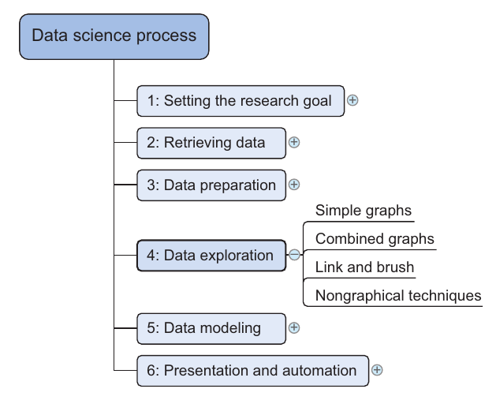

Modeling building
========================================================
- Major steps
  +  Selection of a modeling technique and variables to enter in the model
  + Execution of the model
  + Diagnosis and model comparison
- Model and variable selection
- Model Execution
- Model diagnostics and model comparison

*****
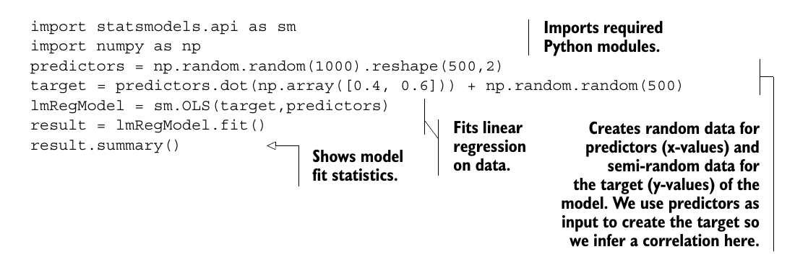

Presenting findings and building applications on top of them
========================================================
- Repetitive actions
- __*Soft skills*__

*****
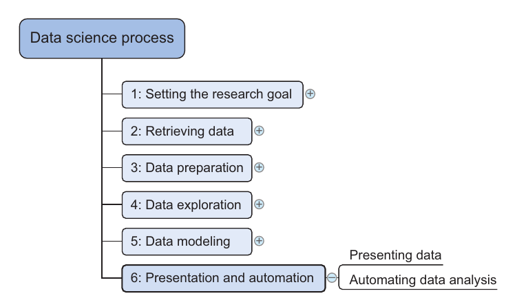

Machine Learning
========================================================
- “Machine learning is a field of study that gives computers the ability to
learn without being explicitly programmed.” —Arthur Samuel, 1959
- “Machine learning is the process by which a computer can work more
accurately as it collects and learns from the data it is given.” —Mike Roberts

Python Tools in Machine Learning
========================================================
- SciPy is a library that integrates fundamental packages often used in scientific computing such as NumPy, matplotlib, Pandas, and SymPy.
- NumPy gives you access to powerful array functions and linear algebra functions.
- Matplotlib is a popular 2D plotting package with some 3D functionality.
- Pandas is a high-performance, but easy-to-use, data-wrangling package. It intro-
duces dataframes to Python, a type of in-memory data table. It’s a concept that
should sound familiar to regular users of R.
- SymPy is a package used for symbolic mathematics and computer algebra.
- StatsModels is a package for statistical methods and algorithms.
- Scikit-learn is a library filled with machine learning algorithms.
- RPy2 allows you to call R functions from within Python. R is a popular open source statistics program.
- NLTK (Natural Language Toolkit) is a Python toolkit with a focus on text analytics.

*****
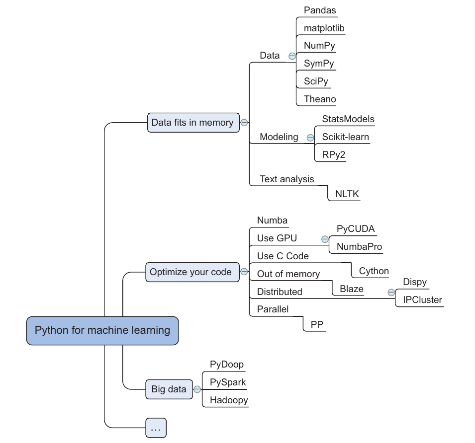

Optimizing Operations
========================================================
- Numba and NumbaPro—These use just-in-time compilation to speed up applications written directly in Python and a few annotations. NumbaPro also allows you to use the power of your graphics processor unit (GPU ).
- PyCUDA —This allows you to write code that will be executed on the GPU instead of your CPU and is therefore ideal for calculation-heavy applications. It works best with problems that lend themselves to being parallelized and need little input compared to the number of required computing cycles. An example is studying the robustness of your predictions by calculating thousands of different outcomes based on a single start state.
- Cython, or C for Python—This brings the C programming language to Python. C is a lower-level language, so the code is closer to what the computer eventually uses (bytecode). The closer code is to bits and bytes, the faster it executes. A computer is also faster when it knows the type of a variable (called static typing). Python hasn’t designed to do this, and Cython helps you to overcome this shortfall.
- Blaze —Blaze gives you data structures that can be bigger than your computer’s main memory, enabling you to work with large data sets.
- Dispy and IPCluster —These packages allow you to write code that can be distributed over a cluster of computers.
- PP —Python is executed as a single process by default. With the help of PP you can parallelize computations on a single machine or over clusters. 
- Pydoop and Hadoopy—These connect Python to Hadoop, a common big data framework.
- PySpark—This connects Python and Spark, an in-memory big data framework.

The modeling processes
========================================================
- Modeling phase consists of four steps:
  + Feature engineering and model selection
  + Training the model
  + Model validation and selection
  + Applying the trained model to unseen data
  
Thank you
========================================================
<!--  -->
<!-- Slide With Code -->
<!-- ======================================================== -->

<!-- ```{r} -->
<!-- summary(cars) -->
<!-- ``` -->

<!-- Slide With Plot -->
<!-- ======================================================== -->

<!-- ```{r, echo=FALSE} -->
<!-- plot(cars) -->
<!-- ``` -->
